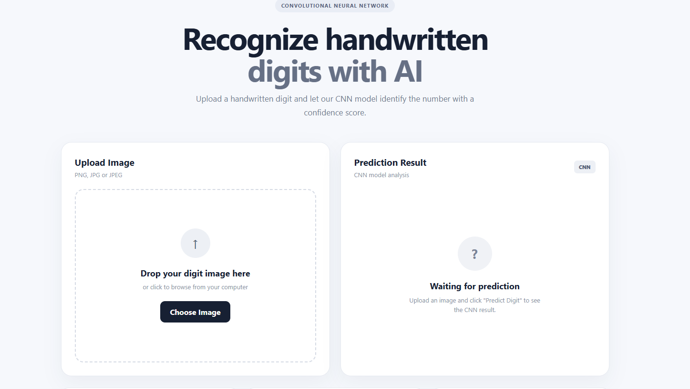
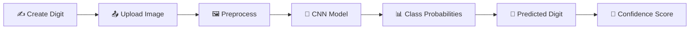

# 🔢 MNIST Handwritten Digit Classification using CNN

<div align="center">

### 🧠 Recognize Handwritten Digits with Artificial Intelligence

**Upload a handwritten digit → CNN analyzes it → Get the predicted number with confidence score**


</div>

---

## 🌟 Project Overview

This project is an **AI-powered handwritten digit recognition system** built using a **Convolutional Neural Network (CNN)**.

The application allows users to upload an image containing a handwritten digit. The trained CNN model processes the image and predicts which digit from **0 to 9** is present.

Along with the predicted digit, the system provides a **confidence/probability score**, helping the user understand how confident the neural network is about its prediction.

---

## 🖥️ Application Preview

<p align="center">
  
</p>

### ✨ Interactive Prediction Interface

- 📤 **Image Upload Panel**
- 🧠 **CNN Prediction Engine**
- 🔢 **Predicted Digit**
- 📊 **Confidence Score**
- ⚠️ **Low-confidence / uncertain prediction indication**
- 🖼️ **Uploaded Image Preview**

---

## ⚙️ How the Application Works

```text
           ✍️ Handwritten Digit Image
                       │
                       ▼
               📤 Upload Image
                       │
                       ▼
             🖼️ Image Preprocessing
                       │
                       ▼
          🧠 Convolutional Neural Network
                       │
                       ▼
              🔍 Feature Extraction
                       │
                       ▼
             📊 Probability Analysis
                       │
              ┌────────┴────────┐
              ▼                 ▼
      High Confidence      Low Confidence
              │                 │
              ▼                 ▼
      ✅ Digit Prediction   ⚠️ Uncertain Result
```

---

## 🔍 Prediction Process

### 1️⃣ Upload Handwritten Digit

The user uploads an image containing a handwritten digit.

**Supported image formats:**

```text
PNG
JPG
JPEG
```

### 2️⃣ Image Processing

Before sending the image to the CNN model, the application prepares the image into the format expected by the trained neural network.

```text
Uploaded Image
      ↓
Resize Image
      ↓
Convert / Normalize Pixels
      ↓
Prepare Model Input
      ↓
CNN Prediction
```

### 3️⃣ CNN Prediction

The CNN analyzes visual patterns such as:

- ✏️ Edges
- ➰ Curves
- 📐 Shapes
- 🔲 Pixel structures
- 🧩 Spatial patterns

These learned features help the model distinguish between:

```text
0  1  2  3  4  5  6  7  8  9
```

### 4️⃣ Probability Calculation

The model generates probabilities for the possible digit classes. The class with the **highest probability** becomes the prediction.

| Digit | Example Probability |
|------:|--------------------:|
| 0 | 0.2% |
| 1 | 0.1% |
| 2 | 0.5% |
| 3 | 0.3% |
| 4 | 0.4% |
| 5 | 0.2% |
| 6 | 0.1% |
| 7 | 1.2% |
| **8** | **96.4% ⭐** |
| 9 | 0.6% |

> **Note:** These probability values are illustrative examples.

---

## 🎯 Confidence-Aware Prediction

The application does more than display the final digit. It also communicates the **confidence of the CNN prediction**.

### ✅ High Confidence

```text
Uploaded Digit: 7
        ↓
CNN Analysis
        ↓
Predicted Digit: 7
        ↓
Confidence: HIGH
        ↓
✅ Reliable Prediction
```

### ⚠️ Low Confidence

If handwriting is unclear, distorted, or significantly different from the training examples, the model may assign a lower maximum probability.

```text
Unclear Digit Image
        ↓
CNN Analysis
        ↓
Lower Maximum Probability
        ↓
⚠️ Prediction is less certain
```

This helps communicate **prediction uncertainty**, which is important in real-world AI systems.

---

## 🧠 Why CNN?

A **Convolutional Neural Network (CNN)** is highly effective for image classification because it automatically learns useful visual features from images.

```text
Input Image
    │
    ▼
┌───────────────┐
│ Convolution   │  → Detect edges and patterns
└───────┬───────┘
        ▼
┌───────────────┐
│ Activation    │  → Learn non-linear features
└───────┬───────┘
        ▼
┌───────────────┐
│ Pooling       │  → Reduce feature dimensions
└───────┬───────┘
        ▼
┌───────────────┐
│ Feature Maps  │  → Extract representations
└───────┬───────┘
        ▼
┌───────────────┐
│ Flatten       │
└───────┬───────┘
        ▼
┌───────────────┐
│ Dense Layers  │
└───────┬───────┘
        ▼
   0 1 2 3 4 5 6 7 8 9
        │
        ▼
   🔢 Prediction
```

---

## 📚 MNIST Dataset

The project uses the famous **MNIST handwritten digit dataset**, a standard dataset for handwritten digit recognition.

```text
╔═══╦═══╦═══╦═══╦═══╦═══╦═══╦═══╦═══╦═══╗
║ 0 ║ 1 ║ 2 ║ 3 ║ 4 ║ 5 ║ 6 ║ 7 ║ 8 ║ 9 ║
╚═══╩═══╩═══╩═══╩═══╩═══╩═══╩═══╩═══╩═══╝
```

The objective is a **10-class image classification problem**.

---

## 🚀 User Journey



---

## 🛠️ Technologies Used

| Technology | Purpose |
|---|---|
| 🐍 **Python** | Core programming language |
| 🧠 **CNN** | Deep-learning architecture |
| 🔥 **TensorFlow / Keras** | Model development and prediction |
| 🔢 **NumPy** | Numerical operations |
| 🖼️ **Image Processing** | Preparing uploaded images |
| 📚 **MNIST** | Handwritten-digit dataset |
| 🌐 **Web Interface** | Interactive prediction system |

---

## 💡 Key Features

- 🔢 Classification of handwritten digits **0–9**
- 📤 User image upload
- 🖼️ Image preprocessing
- 🧠 CNN-powered prediction
- 📊 Probability-based classification
- 🎯 Confidence-aware results
- ⚠️ Indication of uncertain predictions
- ⚡ Fast model inference
- 🎨 Clean modern interface
- 💻 Interactive AI application
- 📱 Simple user workflow

---

## 🌍 Real-World Applications

### 🏦 Banking
Recognizing handwritten numbers on forms and financial documents.

### 📮 Postal Automation
Recognizing handwritten postal codes.

### 📝 Document Digitization
Converting handwritten numerical information into digital data.

### 🏢 Form Processing
Automatically extracting numbers from handwritten forms.

### 🎓 Education
Recognizing handwritten numerical answers in educational applications.

### 🔍 OCR Systems
Serving as a foundation for more advanced optical character recognition systems.

---

## 🔮 Future Improvements

- ✍️ Draw-a-digit canvas
- 📷 Camera-based digit recognition
- 📱 Mobile-friendly interface
- 📊 Prediction probability chart
- 🧠 More advanced CNN architecture
- 🔄 Data augmentation
- 📝 Multi-digit recognition
- 🔤 Handwritten character recognition
- 🌐 Cloud deployment
- 📡 REST API for model inference

---

## 🎓 Skills Demonstrated

```text
Deep Learning
├── Neural Networks
├── CNN Architecture
├── Image Classification
├── Model Training
└── Model Inference

Computer Vision
├── Image Preprocessing
├── Pixel Normalization
├── Feature Extraction
└── Pattern Recognition

Machine Learning
├── Multi-Class Classification
├── Probability Prediction
├── Confidence Analysis
└── Model Evaluation

Development
├── Python
├── TensorFlow / Keras
├── Web Integration
└── AI Application Development
```

---

## ⭐ Project Highlights

> 🧠 **CNN-Based Computer Vision**  
> The project uses deep learning to identify visual patterns in handwritten digits.

> 🎯 **Confidence-Aware Results**  
> The application communicates how strongly the model supports its predicted class rather than displaying only a number.

> 💻 **Interactive AI Application**  
> The trained model is integrated into a user-facing application where users can upload their own handwritten digit images.

> 🌍 **Real-World ML Workflow**  
> The project demonstrates the complete journey from image input and preprocessing to model inference and user-facing results.

---

<div align="center">

## 👨‍💻 Developed By

### **Tushar Vala**

**AI/ML Developer | Data Analyst**

🧠 Machine Learning • Deep Learning • Data Analytics • Computer Vision

---

### ⭐ If you like this project, consider giving the repository a star!

**Made with 🧠 Deep Learning + ❤️ Python**

</div>
